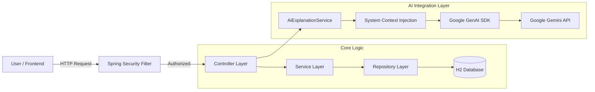

# 💰 FinanceApp – AI-Powered Personal Finance API

[](https://www.oracle.com/java/)
[](https://spring.io/projects/spring-boot)
[](https://www.docker.com/)
[](https://deepmind.google/technologies/gemini/)

**FinanceApp** is a full-stack personal finance management system designed to help users track expenses, manage savings goals, and visualize financial health.

It distinguishes itself with a built-in **Generative AI Assistant**, powered by **Google Gemini 1.5 Flash**. The AI is "context-aware"—it understands the specific API structure, database schema, and security model of the application, allowing users to ask technical questions (e.g., *"How does auth work?"*) or functional questions (e.g., *"How do I add a transaction?"*) in natural language.

---

## ✨ Key Features

### 🤖 Context-Aware AI Assistant (New!)
* **Deep Integration:** The AI is not a generic chatbot. It operates with a **System Context** that contains the app's full API documentation and architectural details.
* **Intent Classification:** A local intent classifier filters queries to ensure the AI stays on topic (Finance & System Architecture).
* **Architecture Explainer:** Capable of explaining internal technical details, such as the H2 database setup or Session-based authentication flow.
* **Markdown Rendering:** The Chat UI renders rich text responses (bold, lists, code blocks) using `Marked.js`.

### 💻 Interactive Frontend
* **Single-Page Chat UI:** A responsive, lightweight HTML/JS interface served directly by the backend.
* **Seamless Auth:** Taps into the backend's session cookie (JSESSIONID), eliminating the need for separate API tokens.
* **Real-time Interaction:** Instant responses via the `com.google.genai` SDK.

### 💸 Core Finance Modules
* **Transactions:** Track Income and Expenses with immutable dates and category validation.
* **Smart Savings Goals:** Goals automatically update progress based on your net income calculation:
  $$\text{Progress} = \text{Total Income} - \text{Total Expenses} (\text{since goal start})$$
* **Reports:** Generate Monthly and Yearly financial summaries.
* **Category Management:** System defaults (Salary, Rent) + User-defined custom categories.

---


## 🏗 System Architecture

The application follows a robust **Layered Architecture** with a dedicated integration path for the AI service.

### 1. High-Level Data Flow



### 2. Component Details

- **Security Layer:**  Uses **Session-Based Authentication** (`**JSESSIONID**`).
- Public access permitted for Auth APIs (`/api/auth/**`) and Frontend (`index.html`).
- All other endpoints are secured behind `HttpSession` validation.
- **AI Service Layer (`AiExplanationService`):**
- Acts as the *Prompt Engineer* for the system.
- Injects a **System Instruction** block containing the **API** Schema and Business Rules into every request.
- Ensures the AI acts as a *Product Expert* rather than a generic bot.

- **DB Development:** H2 In-Memory Database (resets on restart).

---

## 🛠 Technology Stack

### Backend

- **Language:** Java 21
- **Framework:** Spring Boot 4.0.1
- **AI Integration:** Google GenAI **SDK** (`google-genai`)
- **Database:** H2 (In-Memory) / Spring Data **JPA**
- **Build Tool:** Maven

### Frontend

- **Core:** **HTML5**, **CSS3**, Vanilla JavaScript
- **Libraries:** `Marked.js` (Markdown parsing)

### DevOps & Deployment

- **Containerization:** Docker (Multi-stage build)
- **Platform:** Render
- **CI/CD:** Auto-deploy from GitHub

---

## 🌐 API Reference

### 🤖 AI Chat Endpoint

| Method | Endpoint | Body | Description |
| --- | --- | --- | --- |
| `POST` | `/api/chat` | `{ *query*: *your question* }` | Sends a prompt to the context-aware AI. |

### 🔐 Authentication

| Method | Endpoint | Description |
| --- | --- | --- |
| `POST` | `/api/auth/register` | Register new user. |
| `POST` | `/api/auth/login` | Login and receive Session Cookie. |
| `POST` | `/api/auth/logout` | Invalidate session. |

### 💰 Transactions

| Method | Endpoint | Description |
| --- | --- | --- |
| `GET` | `/api/transactions` | List all transactions. |
| `POST` | `/api/transactions` | Create a new transaction. |
| `PUT` | `/api/transactions/{id}` | Update transaction details. |
| `DELETE` | `/api/transactions/{id}` | Delete a transaction. |

---

## ▶ Getting Started

### Prerequisites

- Java 21 **SDK**
- Maven
- **Google Gemini **API** Key** (Get one at [aistudio.google.com](https://aistudio.google.com/))

### 1. Run Locally

```bash # Clone the repository git clone [https://github.com/yourusername/financeapp.git](https://github.com/yourusername/financeapp.git) cd financeapp

# Run the app (Replace with your actual API Key)

# Windows (PowerShell) $env:GEMINI_API_KEY=*your_api_key_here*; ./mvnw spring-boot:run

# Mac/Linux

export GEMINI_API_KEY=your_api_key_here ./mvnw spring-boot:run

```

### 2. Access the App

Once running, open your browser to: 👉 **[http://localhost:**8080**](https://[www.google.com/search?q=http://localhost:**8080**](https://www.google.com/search?q=http://localhost:**8080**))**

1. **Login** with default credentials: `[john.doe@example.com](mailto:john.doe@example.com)` / `password123`.
2. **Chat** with the assistant using the interface.

---

## 🐳 Docker Support

You can run the entire stack (Frontend + Backend + AI) in a single container.

**1. Build the Image**

```bash
docker build -t financeapp .
```

**2. Run the Container** Pass your **API** key as an environment variable:

```bash
docker run -p 8080:8080 -e GEMINI_API_KEY=your_actual_api_key financeapp
```

## 🚀 Deployment (Docker Hub Method)

Since this project uses a custom Docker setup, the deployment strategy relies on building the image locally and pushing it to a container registry (Docker Hub) before deploying to Render.

### 1. Build & Push Image
Run these commands in your local terminal to upload your application image to Docker Hub.

```bash
docker login
docker build -t your-username/financeapp:latest .
docker push your-username/financeapp:latest
```

### 2. Deploy on Render

1.  Log in to your [Render Dashboard](https://dashboard.render.com/).
2.  Click **New +** and select **Web Service**.
3.  Choose **"Deploy an existing image from a registry"**.
4.  Enter your image URL:
    `docker.io/your-username/financeapp:latest`
5.  Click **Next**.
6.  **Configure Environment:**
  * Scroll down to **Environment Variables**.
  * Click **Add Environment Variable**.
  * **Key:** `GEMINI_API_KEY`
  * **Value:** `(Paste your actual Google Gemini API Key here)`
7.  Click **Create Web Service**.

#### Now Render will automatically build the Docker image and deploy.


## 📧 Contact

**Author:** [Lakshit Khandelwal]
* **GitHub:** [github.com/degeneratorXx](https://github.com/degeneratorXx)
* **Email:** lakshitkhandelwal.dev@gmail.com

_Built with ❤️ using Java, Spring Boot, and Google Gemini AI._